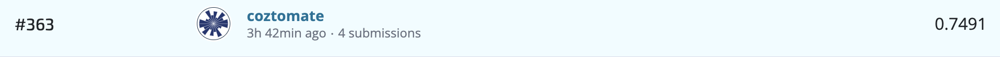
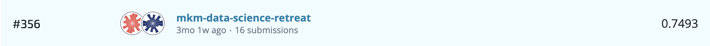

# Damage Grade Prediction for Buildings Affected by the Gorkha Earthquake

An insightful endeavour aimed at predicting building damage from the notorious Gorkha Earthquake in 2015. By leveraging the powerful pairing of XGBoost and Optuna, this project endeavors to not just predict but to understand the relationship between various factors and the extent of damage. Our aim is to build a robust, intuitive model using extensive feature selection, optimization and machine learning techniques.

## Prerequisites
Before running this project, ensure that you have the following installed:

- Python 3.11
- pip (Python package installer)

## Installation
To set up this project on your local machine, follow these steps:

1. Clone the repository to your local machine.
2. Navigate to the repository directory.
3. Run `make install` to install all necessary dependencies. This command uses the Makefile to set up the environment and install all required Python packages.

## Usage
To run the main analysis execute the main file in the notebooks folder.
You can also find the Optuna notebook in the notebooks folder. This notebook is used for hyperparameter tuning of the models.

## Repository Structure
- notebooks: This folder contains the Jupyter notebooks for the project.
    - main.ipynb: The main notebook to run for getting the prediction.
    - optuna.ipynb: Notebook used for hyperparameter tuning with Optuna.
- src: This folder contains modularized code with various functions used in the project.

## Results

First submission:

Last submission (status Jan 24):

## Contributors

@https://github.com/coztomate
@https://github.com/windwithbirds
@https://github.com/madisson1
